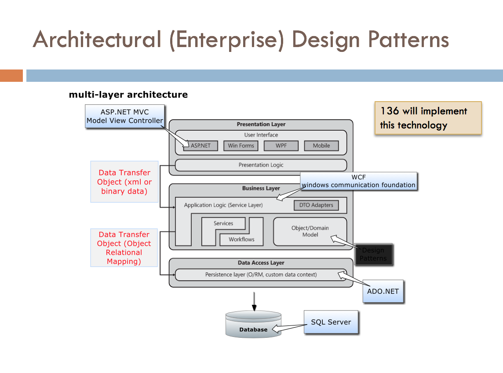
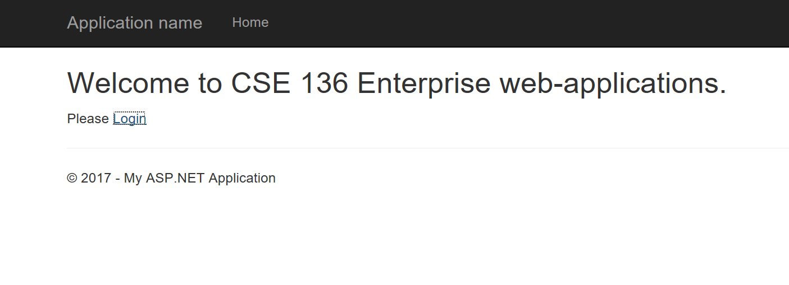
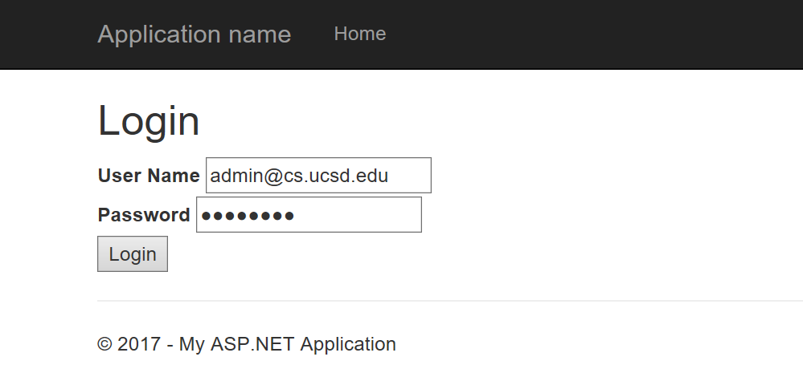
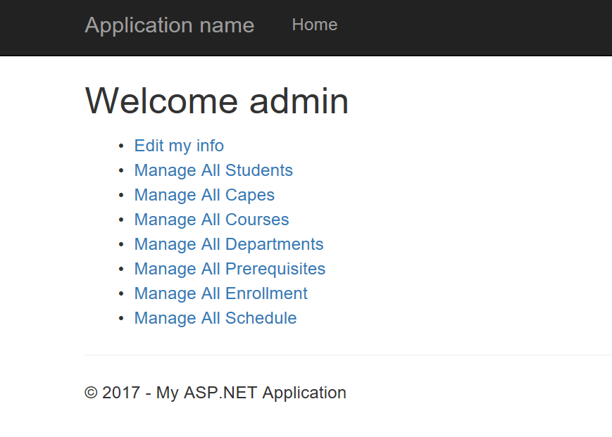
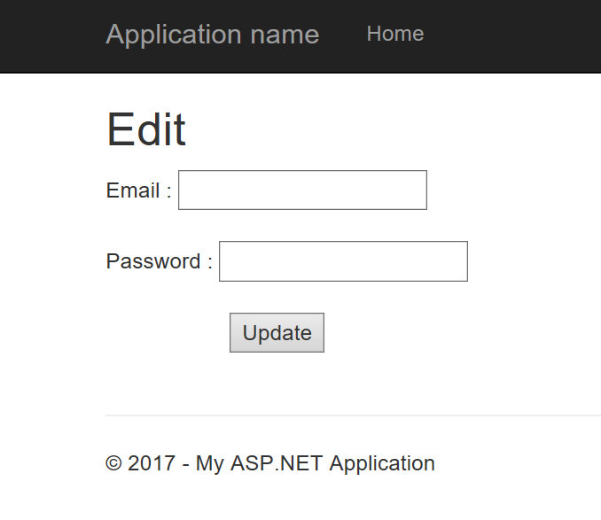
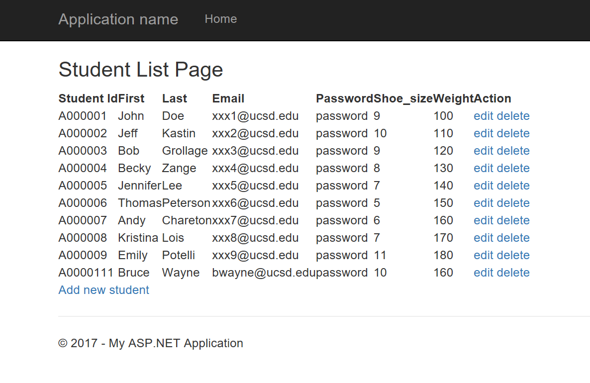
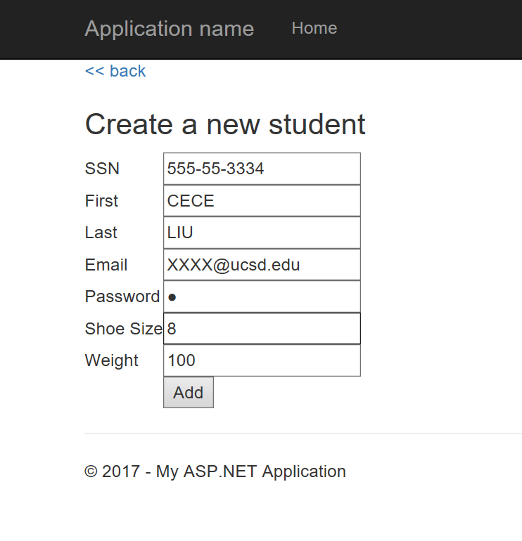

# ClassDesign

This is a Enterprise-class Web Application designed in CSE 136 class in University of California, San Diego. This Web Application allows administrators and staffs to manage school functionalities, such as departments, students, courses, courses’ prerequisites, schedules, enrollments and capes.

## Architectural (Enterprise) Design Patterns

  

## Pages
 The brief introduction of different pages, each with different functions and different designs.

###  1. Home Page
 This page provides links to the login page.
 
 
 
###  2. Login Page
 The user could log in with his administrator, staff or student account. 
 
  

###  3. Admin Menu Page
 The home page provides links to the other pages that depend on whether the user is an admin, staff or student. Administrator have access to all the pages that other people have access but not vice versa. 
 
  

###  4. Edit Page
 Every user has this page regardless of their roles since everyone could edit their own information. 
 

###  5. Student List Page
  All the page linked to the menu page are designed to be very similar, so taking the "Manage All Students" for an example. 
 
 
 
 In this page, the administrator could see all the information of every students, and he could "edit" or "delete" a student, while staffs could just edit student but not delete.
 
 At the end of the list there is a link for adding new students. 
 
 ###  6. Add Student Page
  In this page, administrator could insert new student with all the information needed. 
 
 
 
  ### 7. Other Pages
  
  All the other links in the menu page lead to similar list page with similar operations but for different objects.
 
## Technologies:
* SQL Management Server
* JavaScript
* Ajax (for Web format)
* Visual Studio for Enterprise Design including Layer Design of Presentation Layer, Business Layer, Service Layer, Data Access Layer and Data Base.
